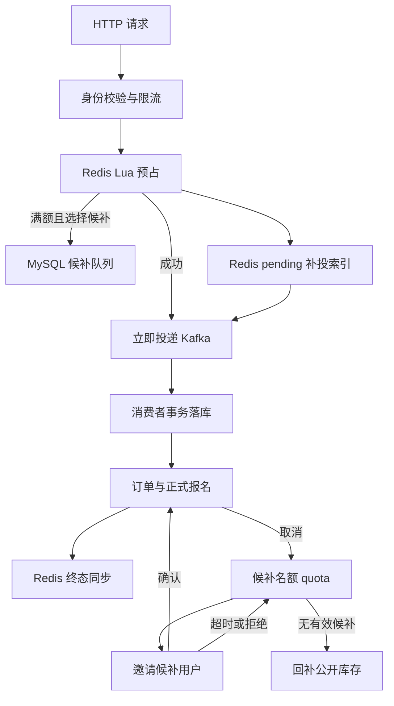

# 架构与代码导航

## 总体设计

普通报名的高频入口使用 Redis 原子预占，Kafka 将落库压力与 HTTP 请求分离。正式报名和候补状态持久化到 MySQL。跨 MySQL、Redis、Kafka 的操作没有一个共同的本地事务，依靠任务记录、幂等执行和定时补偿逐步达到一致。

## 代码目录

| 路径（相对 src/main） | 职责 |
| --- | --- |
| `java/com/campus/ticket/controller` | 路由、请求响应、调用服务 |
| `java/com/campus/ticket/service` | 业务规则与事务编排 |
| `java/com/campus/ticket/mapper` | MyBatis SQL、条件更新与行锁 |
| `java/com/campus/ticket/dto` | 请求、响应、消息与任务载荷 |
| `java/com/campus/ticket/constants` | Redis 键、期限等常量 |
| `resources/lua` | Redis 原子校验、扣减、限流、候补同步 |
| `resources/application-async.properties` | Kafka 与异步任务运行配置 |

在 IDEA 使用“导航到类”搜索下列类名，可沿调用链阅读，避免一次打开所有代码。

## 普通报名执行顺序

1. `RegistrationController` 取得登录用户，执行用户窗口与接口桶限流，调用 `BookingSubmissionService`。
2. `BookingSubmissionService` 选择普通报名或在明确满额时调用候补业务。自动候补是后端编排，客户端通过 joinWaitlistIfFull 表达意愿。
3. `BookingService` 调用 Redis 预占脚本：检查库存、活动时间和用户占用，扣减可售名额，保存 request 和 pending。Lua 原子性只覆盖该次 Redis 脚本，不覆盖 MySQL。
4. `BookingDispatchService` 尝试立即投递；`BookingDispatchJob` 按活动扫描 pending 补投。claim 脚本把下一次允许投递时间延后，减少多个实例同时重复发送；消息仍可能重复。
5. `BookingConsumer` 调用 `BookingConsumeService`，在事务中锁定相关行，检查订单是否已经终态，再扣减数据库名额、插入或恢复报名记录、写订单与日志。
6. 数据库事务提交后执行 Redis 终态同步；失败时保留标记，由 `BookingRedisSyncJob` 重试。消费者异常由 Kafka 错误处理与死信机制处理。

“幂等消费”表示同一业务请求即使被消费多次也不重复产生报名效果，不表示 Kafka 永远只交付一次。

## 取消与候补执行顺序

取消事务把 registration 和 booking_order 改为 CANCELLED，建立 waitlist_quota 和 HOLD 同步任务。名额暂时由候补流程持有，不能先放回公开库存再分配，否则可能被普通请求抢走。

`WaitlistCoordinator.progress` 有限循环，每轮优先执行待同步任务，完成后再调用 `WaitlistWorkflowService.advance` 推进数据库业务状态：HELD 分配候补 → PREPARING 邀请同步 → OFFERED 等待确认 → CONFIRMED/EXPIRED/CANCELLED。

确认邀请通过数据库事务生成成功订单，再创建 CONFIRM 同步任务；超时通过 RELEASE 任务清除用户预占，再分配下一人。无人可递补时执行 RETURN。任务回执与版本共同阻止重复回补、旧任务覆盖新状态。详见 [候补流程](waitlist-flow-guide.md) 和 [数据字典](data-model.md)。

## 缓存与限流

活动和场馆公开详情采用 Caffeine → Redis → MySQL 查询路径。Redis 保存逻辑过期时间；热点数据过期后可以先返回旧值，交给异步执行器重建；冷缓存依靠 Redisson 互斥锁控制回源。空值缓存降低不存在记录的重复查询，活动布隆过滤器提前排除部分不存在的 ID。场馆没有单独布隆过滤器。

缓存失效版本用于阻止旧的异步重建结果覆盖更新后的缓存；它不等于跨实例 L1 主动失效广播。当前不同实例的 L1 仍可能在短 TTL 内返回旧值。

IP 过滤器作用于登录及报名入口，读取 remoteAddr，未实现可信代理下的转发头解析；报名用户使用滑动窗口，接口总量使用令牌桶。Lua 返回的等待时长用于 429 的 Retry-After，后端不会替客户端自动发下一次请求。

## 事务边界

`@Transactional` 管理同一数据源的数据库事务。`SELECT ... FOR UPDATE` 才建立数据库行锁，锁持续到事务提交或回滚；Java 方法名称本身没有锁作用。事务中断时未提交修改回滚，已提交事务不会因后续 Redis 异常自动撤销，因此需要持久化同步任务。
